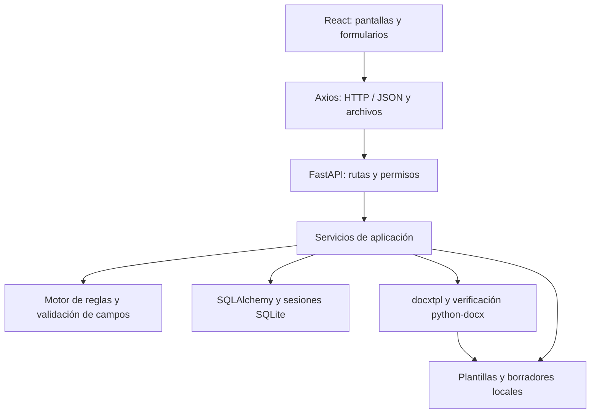

# Arquitectura actual

Revisada el **8 de octubre de 2026**. [Índice documental](README.md) · [Mapa de módulos](modules.md) · [Plan estructural](PLAN_MEJORA_ESTRUCTURAL.md).

## Comunicación y despliegue local

La aplicación es un monolito por capas en FastAPI con una interfaz React. SQLite, plantillas, adjuntos y borradores se almacenan localmente. La preparación inicial descarga las dependencias; el funcionamiento de la aplicación no requiere servicios cloud, registros públicos remotos ni una base externa.

Las API conectan la interfaz con el backend del propio sistema: autentican, consultan y guardan datos, ejecutan reglas y entregan archivos. No hay conectores a RGP, SAT o RENAP. Los datos registrales capturados se contrastan con los datos disponibles en el expediente; su autenticidad requiere revisión profesional.

En desarrollo, Vite sirve la interfaz y redirige `/api/v1` al backend mediante su proxy. [La guía de instalación](installation.md) explica los puertos, variables y rutas de archivos. [App principal](../backend/app/main.py) configura FastAPI, CORS y el prefijo; [el agregador de rutas](../backend/app/api/v1/api.py) registra los módulos. OpenAPI se consulta en `http://127.0.0.1:8000/api/v1/docs` con los valores predeterminados.

## Responsabilidades existentes

| Ubicación | Responsabilidad |
|---|---|
| [frontend/src/App.tsx](../frontend/src/App.tsx) | Composición de proveedores y rutas |
| [frontend/src/app](../frontend/src/app) | AppProviders, AppRoutes y AppLayout; conserva el orden de proveedores y navegación |
| [frontend/src/features](../frontend/src/features) | Pantallas, formularios y componentes por funcionalidad |
| [frontend/src/shared/api/client.ts](../frontend/src/shared/api/client.ts) | Cliente Axios común, configuración e interceptor de sesión |
| [frontend/src/shared/api/errors.ts](../frontend/src/shared/api/errors.ts) | Mensajes comunes de errores API |
| [API y tipos por funcionalidad](modules.md) | api.ts y types.ts dentro de cada módulo, incluido campos dinámicos |
| [frontend/src/shared/types.ts](../frontend/src/shared/types.ts) | CaseType, contrato usado por expedientes, plantillas y experimento |
| [frontend/src/features/auth](../frontend/src/features/auth) | Sesión, LoginModal y RequireAuth para acceso a pantallas |
| [backend/app/api](../backend/app/api) | Entradas HTTP, autenticación y permisos |
| [backend/app/schemas](../backend/app/schemas) | Contratos y validación Pydantic |
| [backend/app/services](../backend/app/services) | Coordinación de persistencia, auditoría, reglas, documentos y medición |
| [backend/app/rules](../backend/app/rules) | Catálogo y ejecución de RULE-001 a RULE-020 |
| [backend/app/models](../backend/app/models) | Mapeo de las tablas SQLAlchemy |
| [backend/app/db](../backend/app/db) | Base, timestamps y sesiones |
| [backend/alembic](../backend/alembic) | Migraciones versionadas |
| [scripts](../scripts) | Preparación, arranque, pruebas, usuarios demo, corpus y respaldo |

Los servicios acceden actualmente a SQLAlchemy. `backend/app/repositories/` contiene solo su inicializador; no constituye una capa de acceso a datos implementada. Hay dependencias compartidas pendientes de ordenar: generación y experimento importan `_build_context` de validación, y varios servicios reutilizan operaciones de persistencia de campos dinámicos. Estos cambios corresponden a la fase estructural 5.

## Captura, validación y generación

Los valores capturados quedan asociados al expediente y a una versión concreta de campos. La validación normaliza datos, calcula valores con `Decimal` y produce hallazgos. El backend genera DOCX con `docxtpl`, inspecciona variables residuales con `python-docx` y registra cada versión con su estado. Las versiones previas se conservan; una plantilla de campos con estado `FIELD_DEFINITION` se distingue de una plantilla DOCX activa.

Los roles y permisos se definen en [roles.py](../backend/app/core/roles.py) y se aplican en [deps.py](../backend/app/api/deps.py). Los controles de acceso de React acompañan los controles del backend. La autenticación usa JWT y contraseñas con Argon2. El experimento utiliza los servicios locales y guarda ejecuciones y etapas; el resultado temporal requiere mediciones reales sobre casos sintéticos.

## Decisiones para la reorganización

1. **Mantener el backend por capas.** Se reorganizarán responsabilidades concretas dentro de las capas existentes. Una capa nueva de repositorios necesitaría una justificación y un alcance propios.
2. **Organizar el frontend por funcionalidad.** La fase estructural 3 distribuyó las API y los tipos antes concentrados en archivos globales, siguiendo la referencia de `features/fields`. No quedan reexports de compatibilidad ni consumidores de las ubicaciones anteriores.
3. **Extraer elementos compartidos cuando tengan consumidores concretos.** Las fases 4–6 ordenarán UI, interfaces públicas y recursos de pruebas. No se crean carpetas vacías como preparación.
4. **Conservar contratos y persistencia.** La reorganización usa como referencia [OpenAPI](testing/baseline/2026-10-08/openapi.json), [el esquema SQLite](testing/baseline/2026-10-08/database-schema.json) y las pruebas existentes. Cualquier cambio funcional adicional requiere identificarse como tal.

Las [convenciones](contributing.md) indican cómo aplicar estas decisiones. El [informe de fase 3](testing/FASE_3_ESTRUCTURAL.md) registra la equivalencia de contratos, navegación y componentes tras la extracción. Los informes de pruebas registran resultados ejecutados; no se establece una latencia garantizada de respuesta.
